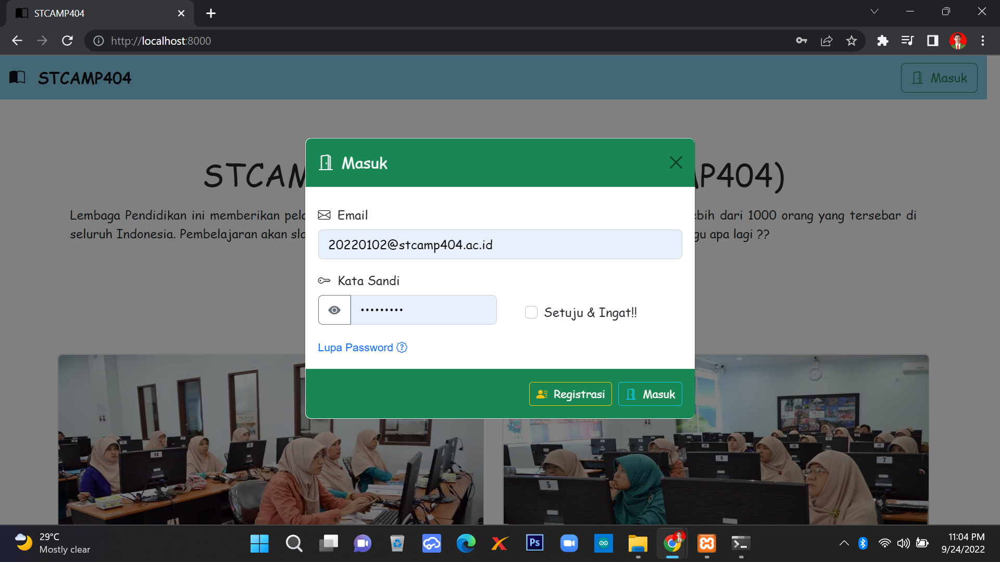
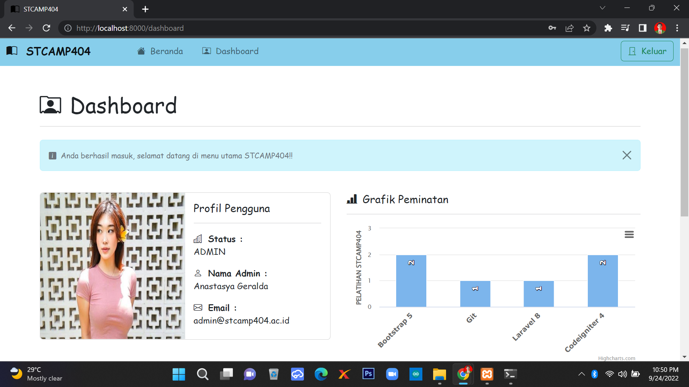
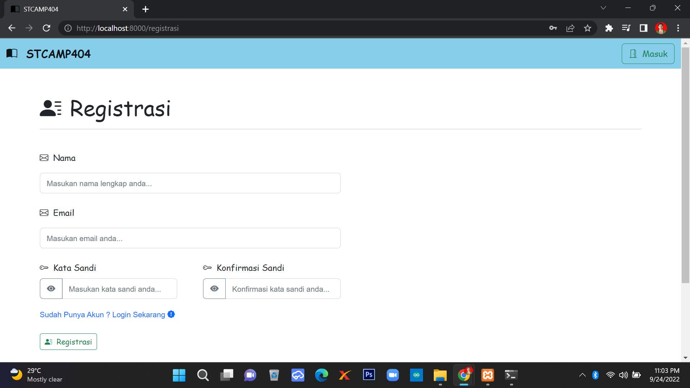

[](https://github.com/ellerbrock/open-source-badges/)
[](https://opensource.org/licenses/MIT)


# STCAMP404
<p>STCAMP404 is the result of the regular CAMP404 Batch 15 training that I customized.</p>

<br><br>

## Project Requirements
| Part | Description |
| --- | --- |
| Features | Login, Create, Read, Update, Delete, Validation, Pagination, Search, Charts, Access Rights by Session/Middleware, ETC |
| Framework | Laravel 8, Bootstrap 5 |
| Tools | Visual Studio Code, XAMPP (PHP Version 7.4), Git |

<br><br>

## Download & Install
1. XAMPP with PHP version 7.4

   <table><tr><td width="810">

   ```
   https://bit.ly/XAMPP_PHP7_Installer
   ```

   </td></tr></table><br>

2. Visual Studio Code

   <table><tr><td width="810">

   ```
   https://bit.ly/VScode_Installer
   ```

   </td></tr></table><br>

3. Git

   <table><tr><td width="810">

   ```
   https://bit.ly/GIT_Installer
   ```

   </td></tr></table>

<br><br>

## Database
1. Open ``` XAMPP ```, then start the ``` Apache ``` & ``` MySQL ``` section. This aims to be able to support the website optimally.<br><br>

2. Access the browser first in order to open the database admin panel, please copy the following link: ``` localhost/phpmyadmin/ ```.<br><br>

3. Create a database called ``` stcamp404 ``` on local.<br><br>

4. Open the ``` stcamp404 ``` database and Import ``` stcamp404_db.sql ``` in the ``` STCAMP404/public/sql ``` directory.<br><br>

5. Then open the XAMP file: ``` php.ini ``` -> remove ``` semicolon (;) ``` in front of ``` extension=intl ``` -> save.

<br><br>

## Default Account
| Role | Email | Full Name | Password |
| --- | --- | --- | --- |
| Admin | admin@stcamp404.ac.id | Anastasya Geralda | 123456 |
| Student | 20220101@stcamp404.ac.id | Jaya Mangunati | 123456 |
| Student | 20220102@stcamp404.ac.id | Jadiyan Marto | 123456 |

<br><br>

## Get Started
1. Download and extract this repository.<br><br>

2. Open the ``` STCAMP404 ``` directory, then open ``` GitBash ``` inside that directory.
   <ul>
       <li>First, check whether there is a problem or not, if there is still an error, just adjust it according to the situation.</li><br>
       <li>Secondly, this step is mandatory, so please copy the following command:<br><br></li>
       
   <table><tr><td width="810">
     
   ````bash
   php artisan serve
   ````

   </td></tr></table>
   </ul><br>
   
3. Open your ``` browser ``` (New tab), then type -> ``` http://127.0.0.1:8000/ ``` or customize the one on your ``` GitBash ```.<br><br>

4. Please login and access the features, enjoy [Done].
    
<br><br>

## Highlights
<table>
<tr>
<th width="280">Home View</th>
<th width="280">Activity Information View</th>
<th width="280">Dashboard View</th>
</tr>
<tr>
<td></td>
<td></td>
<td></td>
</tr>
</table>
<table>
<tr>
<th width="280">Registration View</th>
<th width="280">Forgot Password View</th>
<th width="280">User Training View</th>
</tr>
<tr>
<td></td>
<td></td>
<td></td>
</tr></table>
<table>
<tr>
<th width="280">Training Data View</th>
<th width="280">Student Data View</th>
<th width="280">Change Data View</th>
</tr>
<tr>
<td></td>
<td></td>
<td></td>
</tr></table>

<br><br>

## Reminder
<p>If the database auto-increment is still not in order, then you can do the following in phpMyAdmin:</p>

<table><tr><td width="840">

```sql
SET  @num := 0;
UPDATE your_table SET id = @num := (@num+1);
ALTER TABLE your_table AUTO_INCREMENT =1;
```

</td></tr></table>

<br><br>

## Appreciation
If this work is useful to you, then support this work as a form of appreciation to the author by clicking the ``` ⭐Star ``` button at the top of the repository.

<br><br>

## Disclaimer
This application is my own work and is not the result of plagiarism from other people's research or work, except those related to third party services which include: libraries, frameworks, and so on.

<br><br>

## LICENSE
MIT License - Copyright © 2020 - Devan C. M. Wijaya

Permission is hereby granted without charge to any person obtaining a copy of this software and the software-related documentation files to deal in them without restriction, including without limitation the right to use, copy, modify, merge, publish, distribute, sublicense, and/or sell copies of the Software, and to permit persons receiving the Software to be furnished therewith on the following terms:

The above copyright notice and this permission notice must accompany all copies or substantial portions of the Software.

IN ANY EVENT, THE AUTHOR OR COPYRIGHT HOLDER HEREIN RETAINS FULL OWNERSHIP RIGHTS. THE SOFTWARE IS PROVIDED AS IS, WITHOUT WARRANTY OF ANY KIND, EITHER EXPRESS OR IMPLIED, THEREFORE IF ANY DAMAGE, LOSS, OR OTHERWISE ARISES FROM THE USE OR OTHER DEALINGS IN THE SOFTWARE, THE AUTHOR OR COPYRIGHT HOLDER SHALL NOT BE LIABLE, AS THE USE OF THE SOFTWARE IS NOT COMPELLED AT ALL, SO THE RISK IS YOUR OWN.
